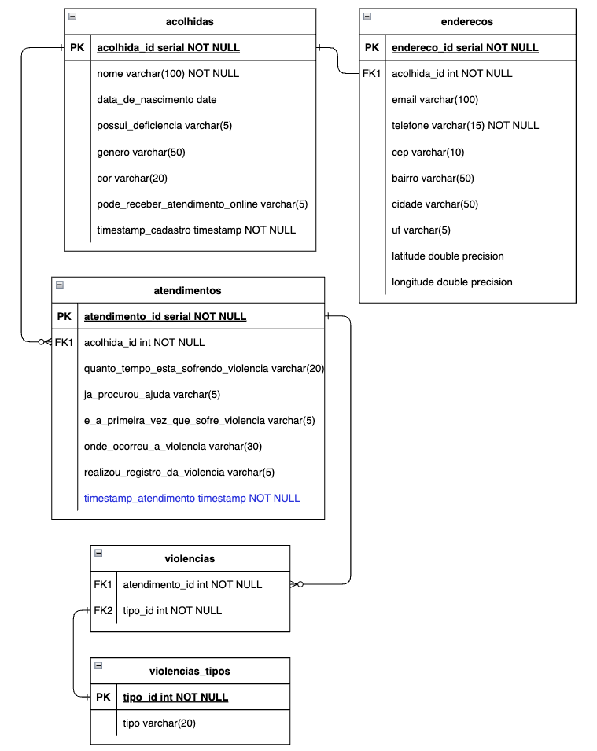

# Mapa do Acolhimento Case


## 🎯 Objectives
Presenting an analytical and technical solution for the case of the NGO Mapa do Acolhimento, focusing on data analysis, modeling, visualizations and practical recommendations to support the organization's mission.

## 🔍 General Approach

- Structuring data ingestion via PostgreSQL, using DBeaver.
- Organization of the pipeline in `bronze`, `silver` and `gold` layers according to good data engineering practices.
- Analysis and visualization in Colab Notebook.
- SQL and Python codes attached.

## 🎲 Database
### Entity-Relationship Diagram


### Layered Architecture - Medallion Model


Schema structure:
* bronze: stores raw data imported from .csv files
* silver: contains processed data, with correct types, primary keys and relational integrity
* gold: “big table” (full_matches) with the union of the three tables except volunteers without match

Creation script: `create_tables.sql`

## 📈 Analysis and Visualizations

Number of matches per year: 2024 showed the highest number of matches in the historical series.


Progress towards the target of 10,000 matches by 2030:


Graph with actual matches up to 2024 and projected matches from 2025 to 2030, based on the average growth observed between 2019 and 2024. It can be said that it is possible to double the total number of matches by 2030, reaching the target of 10,000.

Restrictions:
* Growth and availability of volunteers.
* It was not possible to know the growth rate of volunteers because there is no information on the start date of volunteers.

Note: An idle / available volunteer is one whose status is "disponivel" and therefore has no match.


The volunteers' service is not restricted to their home state:


Analysis script: `questions.sql` & `mapa_acolhimento.ipynb`

## 👩🏻‍🔬 Testing and Experimentation
Objective: to assess whether WhatsApp increases the response rate of recipients compared to email.

Hypothesis:
* H0: The response rate is the same for WhatsApp and email
* H1: The response rate is different

Suggested approach: A/B test
* Randomly divide the recipients into two groups 
* Select a sample of recipients and send the survey by email to half of them and by WhatsApp to the other half
* Compare response rates with a statistical test

Metric:

$$
\text{Response Rate} = \frac{\text{Responses}}{\text{Submissions}}
$$

## 🗂️ Payload Data Modeling and Engineering
### Data governance
* Clear separation between raw (bronze) and processed (silver) data - Medallion Architecture
* Data ingestion (bronze)
* Standardization of names and types in tables (silver)
* Access control and anonymization of sensitive data (silver)
* Integrity validation with primary and foreign keys

### Modeling and Transformation
The payload for registering women in care was analyzed and transformed into a normalized relational model, including the entities `acolhidas`, `enderecos`, `atendimentos`, `violencias`, `violencias_tipos` and their relationships. The transformation was carried out using Python and pandas.



The `transform_payload.py` file transforms the host registration payload - originally in JSON format - into a structured tabular format.
To execute the transformation:

```
python3 transform_payload.py
```

## 🧠 Conclusion
The data analyzed indicates that the Mapa do Acolhimento project has made progress in its mission, but there are challenges to overcome in terms of communication with the people it welcomes.

## 🛠️ Technologies used


## 👩🏻‍💻 Author

[](https://www.linkedin.com/in/pathilink/)

## 🔓 License

[](https://opensource.org/licenses/MIT)
